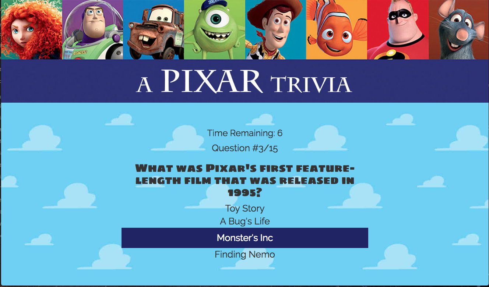

# Trivia Game
Week 5 Assignment: Trivia Game

## A Pixar Trivia

Created during Week 5 of Rutgers Coding Bootcamp. The challenge was to create a timed trivia game. Only 15 seconds were alotted to each question. After all of the questions were finished, the final scoreboard of how well you did would appear.

## Motivation

I wanted to create a Pixar trivia game that was towards the more difficult side and gave animation buffs a challenge. I also created a simpler version for friends and family after the initial app that can be found here: https://pixartriviajr.herokuapp.com/

## Getting Started 
Play here: https://pixartrivia.herokuapp.com/

## Screenshots


Displays time left, question number, and highlights answers on hover.


Displays answer if answered incorrectly


Final Scoreboard

## Technologies used
- Google Fonts
- Bootstrap
- jQuery

### Prerequisities

```
- Bootstrap: visit http://getbootstrap.com/getting-started/ for the CDN and link in html
- jQuery: visit http://code.jquery.com/ and link in html
```

## Built With

* Sublime Text - Text Editor
* Bootstrap- Wireframe

## Authors

* **Stefanie Ding** - *HTML/CSS/JS* - [Stefanie Ding](https://github.com/StefanieDing)

## Acknowledgments

* Thanks to Dan, Nate, and Jimmy from Rutgers Coding Bootcamp for additional help.